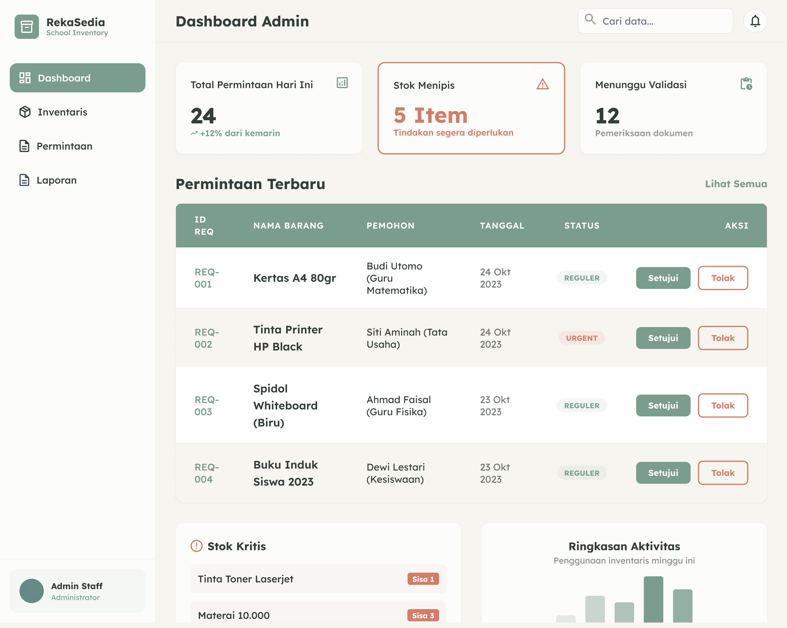
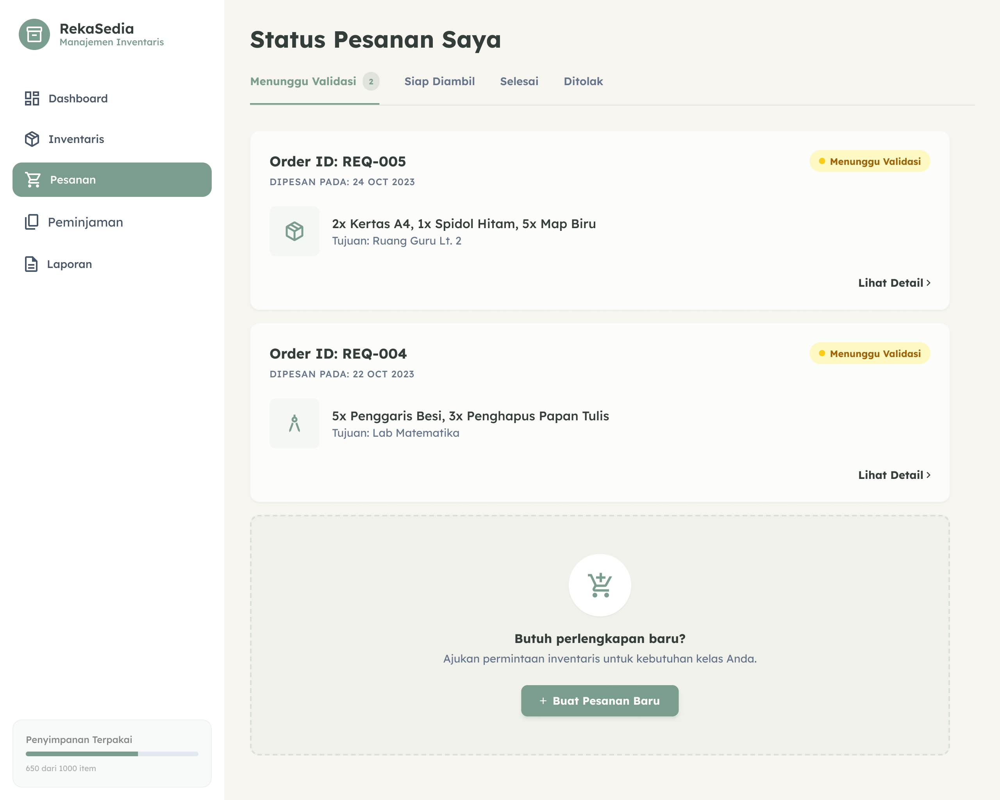

# RekaSedia

  <strong>Aplikasi inventaris sekolah untuk alur Sarpras yang lebih rapi, cepat, dan mudah dipantau.</strong>

  
  
  
  

  <a href="#tampilan-aplikasi">Tampilan</a> |
  <a href="#fitur-terbaru">Fitur Terbaru</a> |
  <a href="#akun-dan-login">Akun</a> |
  <a href="#cara-menjalankan">Cara Menjalankan</a> |
  <a href="#tech-stack">Tech Stack</a>

---

## Tentang Project

RekaSedia adalah aplikasi inventaris sekolah untuk membantu admin Sarpras dan guru mengelola kebutuhan barang harian. Aplikasi ini mencakup alur melihat stok, mengajukan permintaan, memvalidasi permintaan, memantau peminjaman aset, serta memulihkan akun guru lewat admin sekolah.

Versi terbaru sudah terhubung ke backend Express dan Supabase PostgreSQL. Mode mock masih tersedia untuk demo ringan, tetapi mode live sekarang menjadi alur utama pengembangan.

| Area | Status Terbaru |
| --- | --- |
| Mode data utama | Live API dengan Supabase PostgreSQL |
| Mode demo | Mock mode opsional via 'VITE_USE_MOCK' |
| Target pengguna | Admin Sarpras dan guru |
| Login guru | NIP atau email |
| Reset password | Admin-assisted reset dengan kode verifikasi |
| Backend | Express + PostgreSQL pool |

## Tampilan Aplikasi

Screenshot tersimpan di 'docs/images/'. Gambar ini mewakili alur utama aplikasi; beberapa detail UI sudah diperbarui setelah screenshot awal dibuat, seperti checkbox login, dropdown filter, layout katalog guru yang lebih penuh, serta alur reset password.

### Login

Halaman awal untuk masuk sebagai admin atau guru. User aktif tidak bisa kembali ke halaman login/register/forgot-password selama token masih berlaku.

### Dashboard Admin

Admin melihat kondisi inventaris, permintaan terbaru, stok kritis, persetujuan akun guru, dan antrean reset password.

### Katalog Guru dan Keranjang

Guru memilih barang dari katalog, memasukkannya ke keranjang, lalu mengirim permintaan untuk divalidasi admin. Grid katalog guru kini lebih penuh di desktop dan tetap responsive di tablet/mobile.

### Status Pesanan Guru

Guru bisa memantau apakah pesanan masih menunggu validasi, disetujui, selesai, atau ditolak.

## Fitur Terbaru

### Auth dan sesi

- Login real-time ke Supabase melalui backend Express.
- Login mendukung NIP atau email.
- Admin tetap bisa login dengan akun admin.
- User aktif diarahkan ke dashboard sesuai role jika membuka halaman auth.
- Token kedaluwarsa membersihkan sesi lokal dan membuka halaman login lagi.
- Backend memblokir akses inventaris/permintaan/laporan jika user wajib mengganti password.

### Import user guru

- Data guru dapat diimpor dari CSV lokal dengan:

      npm run import:users

- Import melakukan upsert berdasarkan NIP/email.
- Password awal memakai pola nama depan + '123'.
- Password disimpan sebagai hash bcrypt, bukan plaintext.
- File data guru lokal diabaikan oleh Git lewat '.gitignore'.

### Reset password admin-assisted

Karena email user guru bukan email penerima pesan, reset password memakai alur admin:

1. Guru membuka halaman Lupa Password.
2. Guru memasukkan NIP atau email.
3. Sistem menampilkan kode verifikasi 'RST-xxxxxx'.
4. Admin melihat antrean reset di dashboard.
5. Admin memverifikasi guru secara manual.
6. Admin menyetujui atau menolak permintaan.
7. Jika disetujui, sistem membuat password sementara.
8. Guru login memakai password sementara.
9. Guru wajib membuat password baru sebelum mengakses aplikasi.

Password sementara berlaku 30 menit dan hanya dipakai untuk transisi ke password baru.

### Inventaris dan permintaan

- Katalog guru memakai grid responsive: 6, 4, 3, 2, lalu 1 kolom sesuai layar.
- Jumlah item per halaman katalog guru diperbesar agar halaman desktop tidak kosong.
- Dropdown filter inventaris diperbaiki agar teks tidak terpotong dan tidak muncul horizontal scrollbar.
- Tanggal dashboard admin memakai format Indonesia, misalnya '20 Juni'; tahun hanya muncul jika tanggal berbeda lebih dari satu tahun.
- Checkbox Ingat Saya dibuat lebih rounded dan diberi animasi kecil agar selaras dengan UI lain.

## Yang Bisa Dicoba

| Peran | Fungsi Utama | Area yang Bisa Dicoba |
| --- | --- | --- |
| Admin | Mengawasi inventaris, memvalidasi permintaan, dan memproses reset password. | Dashboard, inventaris, validasi permintaan, laporan, reset password. |
| Guru | Mengajukan kebutuhan barang dan memantau status permintaan. | Katalog barang, keranjang, pesanan, peminjaman, laporan personal. |

Alur utama live API:

- Guru login memakai NIP/email.
- Guru membuat permintaan dari katalog.
- Permintaan muncul di dashboard dan halaman validasi admin.
- Admin menyetujui atau menolak permintaan.
- Jika disetujui, stok ikut berkurang.
- Reset password guru diproses dari dashboard admin.

## Mode Data

### Live Supabase

Gunakan '.env' lokal:

      DATABASE_URL=postgresql://...
      PORT=3001
      VITE_USE_MOCK=false

Jangan commit '.env'. File ini sudah masuk '.gitignore'.

Script penting:

| Perintah | Fungsi |
| --- | --- |
| 'npm run server' | Menjalankan backend Express. |
| 'npm run dev' | Menjalankan frontend Vite. |
| 'npm run dev:full' | Menjalankan frontend dan backend bersamaan. |
| 'npm run migrate:password-reset' | Menambahkan schema reset password ke database. |
| 'npm run import:users' | Mengimpor/upsert user guru dari CSV lokal. |

### Mock Mode

Mock mode masih tersedia untuk demo ringan dengan mengaktifkan 'VITE_USE_MOCK'. Data mock disimpan sementara di browser, sehingga tidak cocok untuk alur production.

## Akun dan Login

| Akun | Login | Catatan |
| --- | --- | --- |
| Admin | 'admin@rekasedia.sch.id' | Untuk dashboard admin, validasi permintaan, dan reset password. |
| Guru impor | NIP atau email hasil import | Password awal mengikuti pola nama depan + '123'. |

Catatan keamanan:

- Password awal hanya untuk setup.
- Untuk reset, admin memberi password sementara.
- Setelah login dengan password sementara, user wajib membuat password baru.

## Cara Menjalankan

Pastikan sudah ada Node.js dan npm.

      npm install
      npm run dev:full

Buka aplikasi di:

      http://localhost:5173

Untuk menjalankan frontend saja:

      npm run dev

Untuk menjalankan backend saja:

      npm run server

Untuk memastikan build production aman:

      npm run build

## Tech Stack

| Bagian | Teknologi |
| --- | --- |
| Frontend | React 19, TypeScript |
| Build Tool | Vite |
| Routing | React Router |
| Chart | Chart.js, react-chartjs-2 |
| Styling | CSS Modules, CSS variables |
| Icons | Font Awesome |
| Backend | Express |
| Database | Supabase PostgreSQL |
| Auth Storage | JWT + localStorage session |
| Password Hash | bcrypt |

## Struktur Project

      src/
        components/        Komponen UI reusable
        data/              Data dummy untuk mock mode
        pages/
          admin/           Halaman dashboard admin
          teacher/         Halaman dashboard guru
        services/          API wrapper dan session helper
        styles/            CSS Modules dan design tokens
        utils/             Helper kecil, termasuk gambar item otomatis

      server/
        routes/            Endpoint Express
        middleware/        JWT auth middleware
        db.js              Koneksi PostgreSQL/Supabase
        import_users_csv.js
        migrate_password_reset.js

File penting:

| File | Fungsi |
| --- | --- |
| 'src/services/api.ts' | Wrapper API frontend, session, dan helper auth. |
| 'src/App.tsx' | Konfigurasi route utama dan auth guard. |
| 'src/components/GuestRoute.tsx' | Mencegah user aktif kembali ke halaman auth. |
| 'src/components/ProtectedRoute.tsx' | Proteksi route berbasis role dan kewajiban ganti password. |
| 'server/routes/auth.js' | Login, register, forgot password, admin reset, dan change password. |
| 'server/import_users_csv.js' | Import/upsert user guru dari CSV lokal. |
| 'server/migrate_password_reset.js' | Migrasi schema reset password. |

## Alur Demo yang Disarankan

1. Login sebagai guru dengan NIP.
2. Buka katalog inventaris.
3. Tambahkan barang ke keranjang dan ajukan permintaan.
4. Logout, lalu login sebagai admin.
5. Buka dashboard atau menu permintaan.
6. Setujui salah satu permintaan.
7. Cek stok di inventaris admin atau katalog guru.
8. Coba alur lupa password dari halaman login.
9. Proses permintaan reset dari dashboard admin.
10. Login sebagai guru dengan password sementara dan buat password baru.

## Status Pengembangan

Yang sudah ada:

- Login dan register UI.
- Login NIP/email ke Supabase.
- Dashboard admin dan guru.
- Katalog inventaris guru responsive.
- Keranjang permintaan guru.
- Validasi permintaan oleh admin.
- Laporan admin dan guru.
- Import user guru dari CSV.
- Reset password lewat admin.
- Wajib ganti password setelah reset.
- Proteksi backend untuk token password sementara.
- Mode mock untuk demo ringan.

Yang bisa dikembangkan berikutnya:

- Upload gambar barang asli.
- Notifikasi WhatsApp/OTP jika nomor guru tersedia.
- Audit log admin yang lebih detail.
- Export laporan yang lebih lengkap.
- Role tambahan selain admin/guru.

## Lisensi

Project ini dibuat untuk kebutuhan akademis dan demo pengembangan aplikasi inventaris sekolah.
